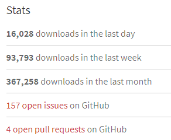
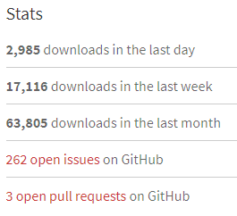
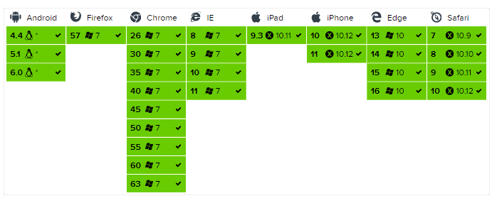

typora-copy-images-to: ..\Images

## Web前端Excel导出库的对比

这里主要是对比[js-xlsx](https://github.com/SheetJS/js-xlsx)和[exceljs](https://github.com/guyonroche/exceljs)，因为这两个库的star数较高，而且活跃度也足够好，最近还在保持commit和release更新。


|                 | js-xlsx                                  | exceljs                                  |
| --------------- | :--------------------------------------- | ---------------------------------------- |
| 活跃度对比           | [来源](https://www.npmjs.com/package/xlsx) |  [来源](https://www.npmjs.com/package/exceljs) |
| 浏览器兼容性          |  | 官方没有给出兼容性报表，测试可以兼容chrome（v63）、IE11、360浏览器，而且如果在浏览器使用，引入代码要特殊处理：` import ExcelJs from 'exceljs/dist/exceljs.min.js';`，否则在浏览器端使用会有can not resolve 'fs'...的错误 |
| 支持格式            | 非常多的的格式互转，能覆盖我们日常常见表格文件格式的读取、导出，还支持导入表格生成html table，[参见](https://github.com/SheetJS/js-xlsx#file-formats) | 目前只看到了xlsx、csv格式的读取和导出                   |
| 文档支持            | 内容全面，但也复杂一些，部分参数设置还得自己去阅读一些标准，对应的示例代码不够全面 | 内容全面，直观，对于每一个小节都有对应的示例代码，比较友好。但也有个问题就是没有延展，如果示例代码没有介绍，就需要自己去读代码或者看issue |
| 行高列宽设置          | 支持                                       | 支持                                       |
| 单元格合并           | 支持                                       | 支持                                       |
| 公式支持            | 支持，可以支持excel内置的函数，通过函数名引入，但是否支持条件语句这个有待验证 | 不支持，虽然提供了公式类型，但需要自己给出计算结果，鸡肋             |
| 文本格式设置          | 不支持                                      | 支持设置字体、字体颜色、字体效果、对齐                      |
| 超链接输入支持         | 支持                                       | 支持，但没有tooltip提示                          |
| 日期格式化支持         | 支持，[在excel中日期原始数据是存储为数值的](https://github.com/SheetJS/js-xlsx#file-formats) | 支持，最好是自己定义格式化                            |
| 数字格式化支持         | 支持：常规格式、内置格式、自定义格式                       | 支持                                       |
| 图表支持            | 不支持                                      | 不支持                                      |
| 插入图片支持          | 不支持                                      | 支持                                       |
| 页边距设置           | 支持                                       | 支持                                       |
| 批注支持            | 支持，但批注作者的长度必须少于54个字符                     | 不支持                                      |
| json与sheet对象互转  | 支持                                       | 不支持                                      |
| array与sheet对象互转 | 支持                                       | 不支持                                      |
| 表格冻结            | 不支持                                      | 支持                                       |
| 表格拆分            | 不支持                                      | 支持                                       |

### 总结

1. 如果需要读取表格数据，并做数据修改，然后进行格式转换输出，并且不需要关心表格样式，则推荐使用xlsx。因为支持互转的格式很多，数据的操作和内容填充的接口也较多，也相对友好。
2. 如果只有数据导出需求，并且要求对导出表格的样式做设置，则推荐使用exceljs。无他，因为xlsx不支持丰富表格样式设置，例如设置单元格字体都不支持。
3. 信鸽校长端中目前使用的是exceljs，已经将它封装成`ExcelSaver`，方便使用，下面是该方法的使用示例。

### 代码示例

这里只是给出简单示例，如果需要更详细的了解或者设置，可以去到[官网](https://github.com/guyonroche/exceljs)查阅文档和代码示例，同时`ExcelSaver`的代码注释中也给出了传入数据的结构要求

``` javascript
import { downloadAsXlsx } from '../../../common/helpers/ExcelSaver';

const fileName = `名单-${moment().format('YYYYMMDD')}.xlsx`;
const fileHead = [
  ['已导入名单'],
  [`未加入${unJoinNum}人，管理员${managerNum}人，用户${userNum}人`],
  ['序号', '姓名', '手机号', '状态/权限']
];
const fileBody = [];
teachers.map((item, index) => {
  fileBody.push([
    `${index + 1}`,
    `${item.get('name')}`,
    `${item.get('phone')}`,
    `${item.get('privilege')}`
  ]);
});
downloadAsXlsx(fileName, {
  //这里的属性名对应文件中的sheet名称，要确保唯一
  '已导入名单': {
    //设置表格数据
    data: [...fileHead, ...fileBody],
    //设置表格样式
    options: {
      //wscols设置列的公共属性，如列宽、该列的数据格式
      wscols: [, {width: 15}, {width: 15}, {width: 25}],
      //wsmerges设置需要合并的单元格
      wsmerges: ['A1:D1', 'A2:D2'],
      //wsrows设置行的公共属性，一般就设置一下行高,或者该行的字体样式
      wsrows: [{height: 40}, {height: 40}],
      //wsCustomStyle设置自定义样式的回调，方便设置一些单元格特有的样式
      wsCustomStyle: (worksheet) => { 
        const headRow = worksheet.getRow(3);
        headRow.font = {bold: true};
        const cellA1 = worksheet.getCell('A1');
        cellA1.font = { size: 16 };
        cellA1.alignment = { vertical: 'middle' };

        const cellA2 = worksheet.getCell('A2');
        cellA2.font = { size: 16 };
        cellA2.alignment = { vertical: 'middle' };
      },
    }
  }
});
```

